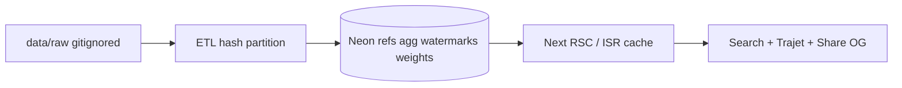

# 02 — Architecture

## Stack

| Layer | Choice |
|-------|--------|
| App | Next.js 16.3.x (App Router), React 19, TypeScript |
| Style | Tailwind 4, shadcn/ui + Radix, Lucide |
| Package | pnpm |
| DB | Neon Postgres (created Phase 1 via MCP) |
| Tests | Vitest (+ component tests Phase 4) |
| Deploy | Vercel (Phase 5) |

**Read `AGENTS.md` / `node_modules/next/dist/docs/` before writing Next APIs** — this Next version may differ from training data.

## System sketch

## Data placement (budget)

| Store | Contents |
|-------|----------|
| Local `data/raw/` (gitignored) | Downloads, GTFS zips, monthly CSVs |
| Neon | Station/line refs, `agg_*` KPI cells, watermarks, weight versions |
| Git | Fixtures synthétiques / extraits anonymisés pour CI |
| Not in Neon | Full raw history dumps |

Alert if Neon project size approaches ~400 Mo (Free ~0.5 Go).

## Performance target

- Hot path p95 &lt; 50 ms = **read `agg_*` + Next ISR/cache**, not cold Neon compute.
- Accept slower first hit after scale-to-zero.
- Full write-up: `docs/perf-cold-start.md` (Phase 1).
- Neon project id: `muddy-paper-90279472` (eu-central-1) — URL only in `.env.local`.

## Auth & secrets

- Zero auth for MVP.
- `DATABASE_URL` and all `.env*` never committed (hook + `.gitignore`).

## Feature flags

- `DATA_PUBLIC=false` until human data validation (see `lib/seo.ts`, `app/robots.ts`).
- Pages emit `noindex` while data unvalidated — flip only via host env after gate.

## Subagent rule (context hygiene)

Heavy CSV/GTFS profiling → subagents (`explorer-data`, `schema-profiler`).  
Main agent codes from summaries in `docs/exploration/`, never pastes raw dumps into the primary thread.

## Skills on demand

Create `etl-diff`, `neon-mcp`, `seo`, `code-quality` skills **when that phase first repeats patterns** — not day one.
